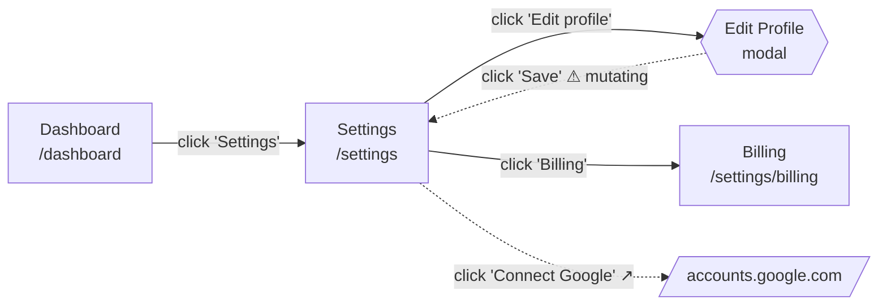

# QAGen — Crawling & Extraction (Deep Dive)

Companion to [ARCHITECTURE.md](ARCHITECTURE.md) and [IMPLEMENTATION_FLOW.md](IMPLEMENTATION_FLOW.md).

This document answers four things in detail:

1. **What we extract, and on what basis** — since Playwright does *not* tell us "this is a form" (§1)
2. **Every kind of popup/overlay and how each is handled** — there are six, not one (§2)
3. **The crawl phase as a precise state machine**, including what a click can actually do (§3)
4. **The navigation graph** — nodes, edges, and why it is what makes code generation possible later (§4)

§5 gives the input/output contract for every phase in the pipeline.

---

## 0. The central correction: Playwright has no semantics

This is worth stating plainly because a lot of the design follows from it.

Playwright gives us exactly two raw signals:

- **The DOM** — tags, attributes, computed styles, geometry
- **The accessibility tree** — `role` and accessible `name` per node, computed by the browser's own ARIA algorithm

That is all. Playwright does **not** know that something is a login form, a search box, a destructive action, or a modal. Every semantic label in our output is produced by *our* classifier, from those two signals plus a rule cascade.

Two consequences shape the whole extraction design:

**Semantics must be inferred, and inference has confidence levels.** A `<form>` tag is certain. A `<div>` with three inputs and a "Continue" button is a form with high confidence. A single text input next to a magnifying-glass icon is a search box with medium confidence. We attach that confidence to the output rather than pretending everything is certain — a `low_confidence` element flows to the LLM labeled as such, and a reviewer can see why a test case is shaky.

**HTML semantics are optional in React, so no single rule is sufficient.** Every classifier below runs a cascade and takes the first rule that fires, ordered most-reliable first. When only the weakest rules fire, confidence drops accordingly.

---

## 1. Extraction — what we pull and how we know what it is

### 1.1 Raw capture

Per settled state, we capture four things:

| Signal | Source | Used for |
|---|---|---|
| Accessibility snapshot | `page.accessibility.snapshot()` | role + accessible name per node — the primary semantic signal |
| Interactive DOM nodes | `page.eval_on_selector_all(INTERACTIVE_SEL, ...)` | attributes, geometry, visibility, enabled state |
| Network log | `context.on("request"/"response")` during settle | endpoint inventory, method, status → negative-test material |
| Console log | `page.on("console")` | JS errors → UI/UX defect signal |

`INTERACTIVE_SEL` is the union of: `a[href]`, `button`, `input`, `select`, `textarea`, `[role]`, `[onclick]`, `[tabindex]:not([tabindex="-1"])`, `[contenteditable]`, `summary`, `label[for]`.

Every captured node is filtered for **actual visibility**, not just CSS presence: non-zero bounding box, not `display:none`/`visibility:hidden`/`opacity:0`, not `inert`, not behind an `aria-hidden` ancestor, and within or scrollable-into the viewport. An invisible element is not part of the current state and must not enter the fingerprint (§3.4) — otherwise a hidden dropdown's contents make every state unique.

### 1.2 Element classification cascade

Each visible interactive node is classified into one `ElementKind`. First matching rule wins; the rule that fired determines confidence.

| Rule (in order) | Signal | Kind | Confidence |
|---|---|---|---|
| 1 | `role="search"` on the node or an ancestor | `SEARCH` | certain |
| 2 | `input[type=search]` | `SEARCH` | certain |
| 3 | `input[type=...]` — email/password/tel/url/number/date/file/checkbox/radio/range/color | typed input | certain |
| 4 | `<select>` / `role=combobox` / `role=listbox` | `SELECT` | certain |
| 5 | `<a href>` with in-origin href | `NAV_LINK` | certain |
| 6 | `<a href>` with external origin, or `target=_blank` | `EXTERNAL_LINK` | certain |
| 7 | `type=submit` inside a `<form>` | `SUBMIT` | certain |
| 8 | `aria-haspopup` ∈ {dialog, menu, listbox, tree, grid} | `OVERLAY_TRIGGER` | high |
| 9 | `aria-expanded` present | `DISCLOSURE` | high |
| 10 | `role` ∈ {tab, menuitem, option, switch, checkbox, radio} | that role | high |
| 11 | name/`aria-label`/`placeholder` matches `/search│query│find│filter│^q$/i` | `SEARCH` | medium |
| 12 | name/text matches destructive vocabulary | `DESTRUCTIVE` | medium |
| 13 | `<button>` or `role=button`, no other signal | `GENERIC_BUTTON` | medium |
| 14 | `[onclick]`/`[tabindex]` on a non-semantic tag (`div`, `span`) | `INFERRED_CLICKABLE` | low |

Rules 13 and 14 are where React's habits land, and they are why the network write-guard (ARCHITECTURE §5.3) is non-negotiable: an unlabeled `<div onClick={deleteAccount}>` classifies as `INFERRED_CLICKABLE` with no destructive signal whatsoever. Text matching cannot catch it. Only blocking the outbound mutation can.

### 1.3 Form detection — explicit and inferred

Forms are the highest-value extraction target, since they drive the Negative, Edge Case, and Form Filling categories. Detection runs in two passes.

**Pass 1 — explicit.** Every `<form>` element. Boundary is the tag; `action` and `method` come from attributes.

**Pass 2 — inferred form clusters.** For inputs *not* inside any `<form>`, we cluster by nearest common ancestor and promote a cluster to a form when all hold:

- ≥2 input-like controls share the ancestor, **or** 1 control of a "committing" type (`password`, `email`, `file`)
- The ancestor subtree contains a plausible submit control (`role=button` whose name matches `/save│submit│continue│next│send│create│update│sign in│log in│register/i`)
- The ancestor is not a page-level landmark (`main`, `body`) — that would swallow the entire page

Inferred clusters get `submit_action: unknown` and `confidence: high` (or `medium` for a single-control cluster). This is what catches React forms that never touch a `<form>` tag — which, on modern apps, is most of them.

### 1.4 Field-level extraction

For every control inside a form (explicit or inferred), we extract:

```python
class FormField(BaseModel):
    name: str | None              # name │ id │ data-testid
    label: str | None             # resolution ladder below
    input_type: str               # text│email│password│select│checkbox│...
    semantic_hint: str | None     # from autocomplete token
    required: bool                # required │ aria-required
    pattern: str | None           # regex constraint
    min: str | None; max: str | None
    minlength: int | None; maxlength: int | None
    step: str | None
    options: list[str] | None     # for select/radio groups
    default_value: str | None
    readonly: bool; disabled: bool
    validation_message: str | None  # aria-describedby / aria-errormessage text
    selector: str                 # verified locator
    confidence: Confidence
```

**Label resolution ladder** (first hit wins): `<label for=id>` → wrapping `<label>` → `aria-labelledby` → `aria-label` → adjacent text node in the same field group → `placeholder` (marked low confidence — placeholder-as-label is an accessibility defect, and worth reporting as one in the UI/UX category).

**`autocomplete` tokens are the highest-value single attribute for form-filling tests.** `autocomplete="email"`, `"given-name"`, `"cc-number"`, `"one-time-code"`, `"postal-code"` tell us exactly what shape of data belongs in the field. That drives realistic Happy Path values *and* precise Negative values — a field tagged `cc-number` gets a Luhn-invalid test case, which no generic "enter invalid text" heuristic would produce.

**Constraint attributes are the negative/edge-case generator.** `maxlength=64` yields a boundary case at 64 and 65. `pattern` yields a matching and a non-matching value. `min`/`max` on a number or date yields under/at/over cases. These are derived deterministically from the DOM *before* the LLM is involved — the LLM writes them up, it does not invent the boundaries.

### 1.5 Search controls — a special case

Search boxes are extracted with extra metadata, because they behave differently from other inputs: they usually mutate nothing (GET), they often produce live suggestions on keystroke, and their result page is a distinct state worth capturing.

```python
class SearchControl(BaseModel):
    input_selector: str
    submit_selector: str | None      # explicit button, or None → Enter key
    live_suggestions: bool           # observed during probe
    result_container: str | None     # selector of the region that changed
    submits_via: Literal["GET", "POST", "client_only", "unknown"]
```

Handling is defined in §3.6.

### 1.6 What a captured state looks like

```python
class PageModel(BaseModel):
    url: str
    normalized_url: str
    title: str
    fingerprint: str
    landmarks: list[Landmark]          # nav/main/aside/header/footer + aria-label
    elements: list[Element]            # classified, with verified selectors
    forms: list[FormSpec]              # explicit + inferred
    searches: list[SearchControl]
    overlays: list[OverlaySpec]        # what is currently open (§2)
    network: list[EndpointObservation]  # method, url pattern, status
    console_errors: list[str]
    blocked_mutations: list[str]       # write-guard log
    capture_status: Literal["complete", "partial_timeout", "partial_error"]
```

---

## 2. Popups and overlays — six kinds, six handlers

This is the section that corrects the earlier documents. "A popup appears" is not one situation. It is six, and they require six different Playwright APIs. Getting any of them wrong produces a hang rather than an error, which is the worst failure mode to debug.

| # | Kind | Examples | Detection API | Consequence if unhandled |
|---|---|---|---|---|
| 1 | **In-DOM overlay** | modal, drawer, dropdown, tooltip, toast | DOM diff — no API fires | Silently treated as the same state; modal content never tested |
| 2 | **New tab / window** | `target=_blank`, `window.open` | `context.on("page")` | Orphan tabs accumulate; crawler loses focus |
| 3 | **Native JS dialog** | `alert`, `confirm`, `prompt`, `beforeunload` | `page.on("dialog")` | **Auto-dismissed silently** — and `beforeunload` blocks navigation |
| 4 | **File chooser** | `<input type=file>` click | `page.on("filechooser")` | **The click hangs** until timeout |
| 5 | **Download** | `Content-Disposition`, `<a download>` | `page.on("download")` | Files accumulate on disk; nav may stall |
| 6 | **Browser permission prompt** | geolocation, notifications, camera | Pre-granted/denied at context level | Blocks the page indefinitely |

### 2.1 In-DOM overlay (the common case)

No event fires. The URL does not change. This is exactly the failure the composite fingerprint exists to catch — and the *only* reason a modal gets explored at all.

Detection after any action:

- A node appears with `role` ∈ {`dialog`, `alertdialog`, `menu`, `listbox`, `tooltip`, `alert`, `status`}
- Or: `aria-modal="true"` appears
- Or: a new subtree is appended as a direct child of `<body>` (the React portal signature)
- Or: a newly visible element has `position: fixed│absolute` with `z-index` above the page's 90th-percentile z-index, and covers >15% of the viewport
- Corroborating signal: focus moved into the new subtree, or `<body>` gained `overflow:hidden` / `aria-hidden` (the focus-trap signature)

Classified into:

| Type | Signature | Crawl treatment |
|---|---|---|
| `MODAL` | `role=dialog` + `aria-modal`, focus trap | New state — explore fully |
| `DRAWER` | fixed panel anchored to a viewport edge | New state — explore fully |
| `DROPDOWN` | `aria-expanded=true` trigger + `role=menu/listbox` | New state — enumerate options, do not recurse |
| `TOOLTIP` | `role=tooltip`, dismissed on blur | **Not** a state — excluded from fingerprint |
| `TOAST` | `role=alert/status`, auto-dismisses | **Not** a state — excluded, but recorded as an observation |
| `CONSENT` | matches cookie/consent vocabulary | Auto-dismissed once at session start (§3.2) |

Excluding tooltips and toasts from the fingerprint matters more than it looks: a toast that appears and auto-dismisses after 4 seconds would otherwise make the same page fingerprint differently on every visit, and the `max_consecutive_no_new_states` budget would be the only thing stopping an infinite crawl.

### 2.2 New tab / window

Registered once on the context, so it catches every origin (`target=_blank`, `window.open`, JS-driven). Behavior as described in ARCHITECTURE §4.2: fingerprint if in scope and enqueue, otherwise record as a boundary; close either way. The crawler never holds more than one live page.

### 2.3 Native JS dialogs — the silent trap

**Playwright auto-dismisses dialogs when no handler is registered.** That means `confirm("Delete this item?")` returns `false` and the crawl continues — which is accidentally the safe outcome, but it is silent, so we would never know the app asked. Worse: `beforeunload` firing during navigation with no handler can stall the crawl.

Explicit policy, registered per page:

```
on dialog:
    record ConfirmationObservation(type, message, triggering_action)
    if type == "beforeunload":  accept()      # allow navigation away
    else:                       dismiss()     # confirm/alert/prompt → the safe branch
```

Confirmation dialogs are *excellent* QA material — a `confirm("Delete this item?")` is direct evidence that a destructive action has a guard, which is a test case in its own right. Recording them rather than silently dismissing them is a real gain, not just correctness housekeeping.

### 2.4 File chooser — the hang

Clicking any `<input type=file>` opens the OS file picker. Playwright suspends the click until a `filechooser` handler responds. **No handler means the click hangs until timeout.** With a 30-second action timeout and a form containing several upload fields, that alone can consume the entire wall-clock budget.

```
on filechooser:
    record FileUploadObservation(accept, multiple, selector)
    chooser.set_files([])         # dismiss without uploading
```

The `accept` attribute is captured and passed to the LLM — a field accepting `.pdf,.docx` generates a precise negative test ("attempt to upload a `.exe`"), which is a much better test case than a generic one.

### 2.5 Downloads

```
on download:
    record DownloadObservation(suggested_filename, url)
    download.cancel()
```

Cancelled, never written. A download-triggering link is recorded as a boundary and its target is not crawled.

### 2.6 Permission prompts

Never allowed to appear. At context creation:

```python
context = browser.new_context(
    storage_state=...,
    permissions=[],                      # deny all by default
    geolocation=None,
)
```

Denied permissions surface in the page as a rejected promise, which is normal app behavior and legitimately testable. An un-suppressed prompt would block the page forever.

---

## 3. The crawl phase, precisely

Nine sub-phases, executed per state. Each has a defined input and output.

```
        ┌──────────────────────────────────────────────────────┐
        │                    FRONTIER (FIFO)                    │
        └───────────────────────┬──────────────────────────────┘
                                ▼
   4A ARRIVE ──▶ 4B STABILIZE ──▶ 4C OBSERVE ──▶ 4D IDENTIFY
                                                      │
                              ┌───────────────────────┤
                     seen ────┘                       ▼ new
                     (record edge, stop)         4E RECORD NODE
                                                      │
                                                      ▼
                                                 4F PLAN ACTIONS
                                                      │
                          ┌───────────────────────────┤
                          ▼                           │  per action
                     4G ACT ──▶ 4H CLASSIFY ──▶ 4I RECONCILE
                          ▲                           │
                          └──── 4J RESTORE ◀──────────┘
```

### 4A — Arrive

**In:** `FrontierItem(url, depth, arrival_edge)` · **Out:** page at URL, or `skip`

Navigate. Check scope: same origin, matches `include_paths`, does not match `exclude_paths`, depth within limit. Out-of-scope → record as a boundary node and skip.

### 4B — Stabilize

**In:** navigated page · **Out:** settled page, consent dismissed

1. Run the settle routine (ARCHITECTURE §3.4): `domcontentloaded` → `networkidle` raced against cap → interactive-signature poll until stable twice.
2. **Consent reconciliation, once per session:** if an overlay classifies as `CONSENT`, click its accept/dismiss control and re-settle. A cookie banner left standing appears in every fingerprint, obscures elements, and pollutes every generated test case with an irrelevant precondition.
3. Dismiss any `TOAST`/`TOOLTIP` overlays from the prior action.

### 4C — Observe

**In:** settled page · **Out:** `PageModel`

Full extraction per §1: a11y snapshot, DOM walk, classification cascade, form detection (both passes), field extraction, search detection, overlay detection, network and console logs. Every synthesized selector is verified to resolve to exactly one element before it is recorded.

### 4D — Identify

**In:** `PageModel` · **Out:** `fingerprint`, plus `seen`/`new`

`fingerprint = sha256(normalize_url(url) ‖ interactive_signature)`, where the signature is the sorted set of `(role, accessible_name, enabled, kind)` for every **visible, non-transient** element. Transient overlays (toast, tooltip) are excluded — see §2.1 for why that exclusion is load-bearing.

Seen → increment hit count, record the arrival edge in the graph, and stop. **This is the single point where every loop terminates.**

### 4E — Record node

**In:** `PageModel` + fingerprint · **Out:** `NavNode` appended to the graph (§4)

### 4F — Plan actions

**In:** `PageModel` · **Out:** ordered `ActionPlan[]`

Not every element is worth clicking, and order matters when budgets are finite. Ranking:

| Priority | Kind | Rationale |
|---|---|---|
| 1 | `NAV_LINK` (in-origin, unseen target) | Highest structural yield |
| 2 | `OVERLAY_TRIGGER`, `DISCLOSURE` | Reveals hidden UI — the states a URL crawler never finds |
| 3 | `tab`, `menuitem` | In-page state changes |
| 4 | `SEARCH` | Probe per §3.6 |
| 5 | `GENERIC_BUTTON` | Unknown yield |
| 6 | `INFERRED_CLICKABLE` | Lowest confidence, highest risk |
| — | `DESTRUCTIVE`, deny-listed, `disabled` | **Skipped**, with reason logged |
| — | `EXTERNAL_LINK` | Recorded as boundary, not clicked |

Truncated at `max_clicks_per_state`. Because the list is ranked, truncation drops the least valuable actions rather than an arbitrary tail.

### 4G — Act

**In:** one `ActionPlan` · **Out:** raw outcome signals

Pre-flight: element still attached, still visible, still enabled (React re-renders constantly — an element captured in 4C may be gone by the time we reach it in 4G). Re-resolve the selector; if it no longer resolves uniquely, skip and log.

Snapshot pre-action state: URL, fingerprint, open page count, event-handler counters. Then dispatch the action with a bounded timeout, with all six overlay handlers from §2 armed.

### 4H — Classify outcome

**In:** pre/post signals · **Out:** one `Outcome`

This is the table that answers "what actually happens when I click something":

| Outcome | Detection | Graph effect |
|---|---|---|
| `NO_CHANGE` | URL same, fingerprint same, no events | Edge to self, marked inert |
| `IN_PAGE_STATE` | URL same, fingerprint changed | Edge → new node (modal, tab panel, expanded section) |
| `NAVIGATION` | URL changed | Edge → new node |
| `NEW_TAB` | `page` event fired | Edge → node or boundary, tab closed |
| `NATIVE_DIALOG` | `dialog` event fired | Edge annotated `confirmation_required` |
| `FILE_CHOOSER` | `filechooser` event fired | Edge annotated `upload`, chooser dismissed |
| `DOWNLOAD` | `download` event fired | Edge → boundary, download cancelled |
| `BLOCKED_MUTATION` | write-guard aborted a non-GET | Edge annotated `mutating` — **high-value QA signal** |
| `ERROR` | console error or exception | Edge annotated `error`, recorded as a UI/UX defect |

`BLOCKED_MUTATION` deserves emphasis. It tells us an element attempts a server write — which is precisely the set of actions a QA suite most needs to cover, and precisely the set we refuse to actually perform. We learn *that* the write exists, and its endpoint and method, without performing it.

### 4I — Reconcile

**In:** outcome · **Out:** graph edge; possibly a new frontier item

Write the `NavEdge`. If the outcome produced an unseen fingerprint, enqueue it with the current depth (in-page states do not consume depth — depth counts navigations, not interactions).

### 4J — Restore

**In:** target fingerprint · **Out:** page back at that state

`Escape` → `go_back()` → `goto(url)` + settle. First one that reproduces the target fingerprint wins. Failure to restore is not fatal: re-fingerprint, treat as current, continue.

### 3.6 Search handling, specifically

You asked about this directly. Search inputs get a dedicated probe rather than a plain click:

1. Focus the input, type a benign probe token (`qa` — short, alphanumeric, harmless).
2. Wait for the settle window. If the fingerprint changes without submission → `live_suggestions: true`, and the suggestion panel is recorded as an overlay state.
3. Submit: click the associated submit control, or press `Enter` if there is none.
4. Classify per §4H. A GET search typically produces `NAVIGATION` to `?q=qa`; a client-only search produces `IN_PAGE_STATE`; a POST search produces `BLOCKED_MUTATION` (recorded, not performed).
5. Record `SearchControl` metadata and the resulting state.
6. Clear the input; restore.

The results state is then subject to normal `normalize_url` collapsing — `?q=qa`, `?q=test`, `?q=foo` all normalize to the same state, so a search box cannot generate unbounded states. **Search is probed exactly once per state**, tracked by a per-state flag, regardless of how many times the element is reachable.

Extracted search metadata drives real test cases: empty-query behavior, no-results behavior, special-character handling, result-count assertions — all generated from the observed control, not guessed.

---

## 4. The navigation graph

You're right that this is worth building, and worth building *now* rather than retrofitting. The graph is a natural byproduct of the crawl — we are already computing nodes (states) and edges (actions). Writing it out costs almost nothing and changes what the tool can do later.

### 4.1 Model

```python
class NavNode(BaseModel):
    id: str                      # N001
    fingerprint: str
    url: str
    normalized_url: str
    title: str
    depth: int
    node_type: Literal["page", "modal", "drawer", "dropdown",
                       "panel", "boundary", "external"]
    element_count: int
    form_ids: list[str]
    is_entry: bool
    visit_count: int

class NavEdge(BaseModel):
    id: str                      # E001
    source: str                  # NavNode.id
    target: str                  # NavNode.id
    action: Literal["navigate", "click", "type", "select",
                    "press_enter", "check", "hover"]
    label: str                   # "Click 'Save changes'" — human-readable
    selector: str                # verified locator — the codegen payload
    element_role: str
    element_name: str
    input_value: str | None      # for type/select actions
    outcome: Outcome
    annotations: list[str]       # mutating │ confirmation_required │
                                 # upload │ error │ inert │ denied
    reversible_by: Literal["escape", "back", "goto", "none"]

class NavGraph(BaseModel):
    target: str
    generated_at: datetime
    nodes: list[NavNode]
    edges: list[NavEdge]
    entry_node: str
    boundaries: list[Boundary]   # external origins encountered
    unexplored: list[str]        # fingerprints hit when budget ran out
```

### 4.2 Why this enables code generation

**A path through the graph from the entry node to any node *is* a test script.** Each edge already carries a verified locator and a concrete action. Emitting runnable Playwright code from a path is a mechanical transform, not an inference problem:

```
Path: N001 ──E004: click "Settings"──▶ N003 ──E011: click "Edit profile"──▶ N007

page.goto("https://app.example.com/dashboard")
page.get_by_test_id("nav-settings").click()
page.get_by_role("button", name="Edit profile").click()
expect(page.get_by_role("dialog")).to_be_visible()
```

This is why the selector-verification step in §4C matters so much. Because every locator in the graph was proven to resolve to exactly one element *at capture time*, generated code has a real chance of running. A graph built from unverified selectors would produce code that looks right and fails immediately — which is worse than producing nothing.

The graph also gives the LLM something it otherwise lacks: **reachability context.** Test preconditions stop being guesses. Instead of "User is on the profile page" the generator can emit the actual navigation path that reaches that state, because the graph knows it.

### 4.3 Emitted artifacts

| File | Purpose |
|---|---|
| `navgraph.json` | Full model — the machine-readable substrate for codegen |
| `navgraph.mmd` | Mermaid — renders directly in GitHub/VS Code, no tooling |
| `navgraph.dot` | Graphviz — for large graphs needing real layout |
| `navgraph-paths.json` | Pre-computed shortest path from entry to every node — the direct input to preconditions and, later, codegen |

Mermaid output, with edge annotations carried through:



Solid edges are safe transitions actually performed; dashed edges are blocked or boundary transitions recorded but not traversed. That distinction is visible at a glance, which makes the graph a review artifact rather than just a data file.

### 4.4 Codegen: enabled now, deferred deliberately

We build and emit the graph in this phase. We do **not** generate executable test scripts yet — that remains out of scope per ARCHITECTURE §9. The reason for the split: script generation needs assertion strategy, fixture/test-data management, and a page-object decision, each of which is a design conversation in its own right. Emitting the graph now means that conversation can happen later without re-crawling anything.

---

## 5. Phase input/output contracts

Every phase, with its exact input, output, and persisted artifact.

| # | Phase | Input | Output | Persisted |
|---|---|---|---|---|
| 1 | **Config resolution** | CLI args, `site.yaml`, env | `RunConfig` (validated) | `run_manifest.json` (config snapshot) |
| 2 | **Session bring-up** | `RunConfig`, `storage_state` JSON | live `BrowserContext` with 6 overlay handlers + write-guard armed | — |
| 3 | **Auth verification** | context, `target.url`, `verify_selector` | `AuthResult{ok, final_url, reason}` | manifest: `auth_status` |
| 4A | Arrive | `FrontierItem(url, depth, arrival_edge)` | page at URL \| `skip(reason)` | — |
| 4B | Stabilize | navigated page | settled page, consent dismissed | manifest: `consent_dismissed` |
| 4C | Observe | settled page | `PageModel` (elements, forms, searches, overlays, network, console) | `pages/<fp>.json` |
| 4D | Identify | `PageModel` | `fingerprint`, `is_new: bool` | `StateRegistry` |
| 4E | Record node | `PageModel` + fingerprint | `NavNode` | `navgraph.json` |
| 4F | Plan actions | `PageModel`, policy, budgets | ranked `ActionPlan[]`, `SkipLog[]` | manifest: skip reasons |
| 4G | Act | one `ActionPlan` | raw pre/post signals + fired events | — |
| 4H | Classify | pre/post signals | one of 9 `Outcome` values | — |
| 4I | Reconcile | `Outcome` | `NavEdge`; optional `FrontierItem` | `navgraph.json` |
| 4J | Restore | target fingerprint | page at that state \| `re-fingerprinted` | — |
| 5 | **Popup handling** | overlay/dialog/chooser/download events | `Observation[]`, tabs closed, dialogs answered | `PageModel.overlays`, manifest |
| 6 | **Summarize** | `PageModel` + reachability path from `navgraph-paths.json` | `PageSummary` (2–5 KB, deterministic order) | `summaries/<fp>.txt` (debug) |
| 7 | **Generate** | `PageSummary`, cached system prompt | `TestCaseBatch` (schema-validated) | — |
| 8 | **Validate** | `TestCaseBatch` + source `PageModel` | `TestCase[]` with IDs normalized, `needs_review` flags | manifest: validation stats |
| 9 | **Report** | `TestSuite` + `NavGraph` | md / json / xlsx / csv / mmd / dot | all output files |

### 5.1 Complete output set

```
qagen-out/
├── test-cases.md              # human review artifact
├── test-cases.json            # full fidelity + provenance
├── test-cases.xlsx            # one row per step — TestRail/Zephyr/Xray import
├── test-cases.csv             # same shape, plain text
├── navgraph.json              # nodes + edges — codegen substrate
├── navgraph.mmd               # renders in GitHub/VS Code
├── navgraph.dot               # Graphviz
├── navgraph-paths.json        # entry → every node, shortest path
├── run_manifest.json          # full audit trail
├── pages/<fingerprint>.json   # raw PageModel per state
└── summaries/<fingerprint>.txt # prompt blocks (debug only)
```

`run_manifest.json` is what answers "why wasn't X tested?" without re-running: every skipped element with its reason, every blocked mutation, every boundary, every budget's final state, token usage, and per-phase timings.

---

## 6. Changes this document makes to the earlier design

Stated explicitly, so the three documents stay consistent:

1. **Overlay handling expanded from 1 kind to 6** (§2). Native dialogs, file choosers, downloads, and permission prompts were missing. Two of those (`filechooser`, `beforeunload`) cause *hangs* rather than errors when unhandled, so they would have appeared during M4 as unexplained stalls.
2. **Transient overlays excluded from the fingerprint** (§2.1). Toasts and tooltips would otherwise make every visit to the same page a new state.
3. **Consent banner reconciliation added to 4B.** A standing cookie banner corrupts every fingerprint and every generated precondition.
4. **Form detection is two-pass** (§1.3). Explicit `<form>` alone misses most React forms.
5. **Action planning is ranked, not arbitrary** (§4F). When `max_clicks_per_state` truncates, it now drops the least valuable actions.
6. **Navigation graph promoted to a first-class output** (§4), with `navgraph.json` / `.mmd` / `.dot` / `-paths.json`. This also improves test-case quality immediately, since preconditions can cite real reachability paths instead of being guessed.
7. **Search gets a dedicated probe** (§3.6) rather than a generic click, and is probed exactly once per state.

---

## 7. Honest limits

Where this design will still need work on a real target:

- **Canvas and WebGL UIs** are opaque to both the DOM and the a11y tree. A charting or design surface yields nothing. We detect and report it as an unextractable region rather than pretending coverage.
- **Drag-and-drop and gesture interactions** are not in the safe-click policy. Kanban boards and reorderable lists will be under-covered.
- **`INFERRED_CLICKABLE` on unlabeled elements** cannot be semantically classified. The write-guard prevents damage, but the resulting test cases will be weak. Sites with icon-only controls and no `aria-label` produce measurably worse output — which is itself a legitimate UI/UX finding worth reporting.
- **Infinite scroll and virtualized lists** re-render on scroll; the fingerprint will churn. Mitigated by `max_consecutive_no_new_states`, but a virtualization-aware rule may be needed.
- **Multi-step wizards with server-side state** cannot be fully traversed without submitting, which safe-click forbids. We extract each reachable step and flag the wizard as partially explored rather than faking a path through it.
