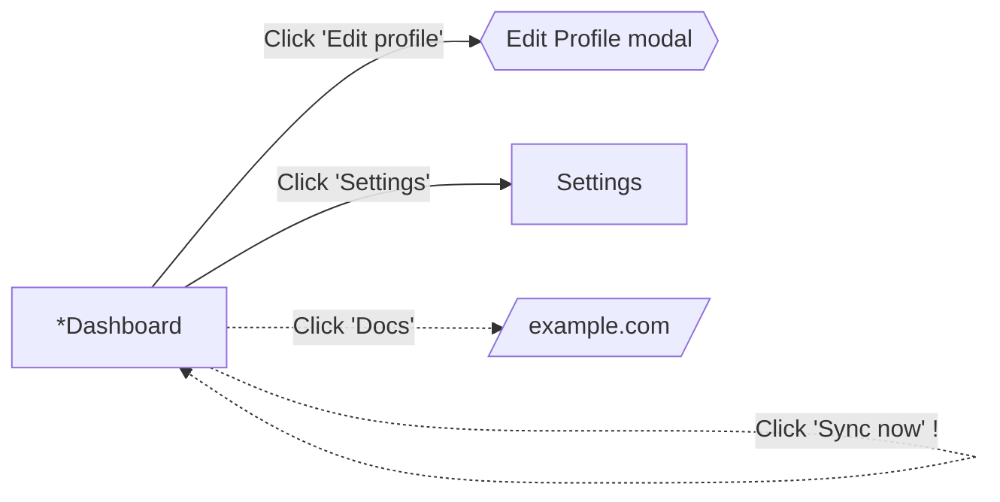

# QAGen

Point it at a URL. It logs in with your cookies, crawls the live app without
mutating it, and writes structured QA test cases plus a navigation graph of the
application.

```
qagen run --url https://app.example.com/dashboard --config site.yaml
```

Or drive it from a browser:

```
uvicorn api.main:app --port 8000     # the control-room API
cd Fronted && npm run dev            # the web UI
```

Design docs: [ARCHITECTURE.md](ARCHITECTURE.md) ·
[CRAWLING_AND_EXTRACTION.md](CRAWLING_AND_EXTRACTION.md) ·
[IMPLEMENTATION_FLOW.md](IMPLEMENTATION_FLOW.md) ·
[WEB_UI_BUILD_PROMPT.md](WEB_UI_BUILD_PROMPT.md)

Web: [api/](api/) (FastAPI over this package) · [Fronted/](Fronted/) (React) ·
[design/](design/) (the screens, as images)

---

## Install

```bash
pip install -e .
python -m playwright install chromium
```

Python 3.10+. Chromium is required for crawling; the pure-unit tests run
without it.

## Quick start

Try it against the bundled fixture app, with no API key and no live target:

```bash
python -m http.server 8899 --directory tests/fixture &
qagen run --url http://127.0.0.1:8899/index.html --depth 1 --provider stub --out ./demo-out
```

Against a real app:

```bash
cp site.example.yaml site.yaml     # then edit target.url and auth.storage_state
qagen validate-config site.yaml    # checks the config without launching a browser
qagen run --config site.yaml
```

## Authentication

Two accepted forms, detected by shape — you never declare which one you have:

- Playwright `storage_state` JSON (`{"cookies": [...], "origins": [...]}`)
- A raw cookie array exported by a browser extension (`expirationDate` and
  lowercase `sameSite` are normalised for you)

Set `auth.verify_selector` to something only a logged-in user sees. Without it,
an expired cookie silently redirects to the login page, the crawler happily
explores it, and you get forty confident test cases for a login form you never
asked about. With it, the run aborts with `AUTH_FAILED`.

## Safety

The crawler is read-only by design, enforced in three independent layers:

1. **Deny-list** — destructive vocabulary and selectors are never clicked.
2. **Form policy** — forms are analysed, never submitted. Negative and
   edge-case tests are derived from field constraints (`pattern`, `maxlength`,
   `min`/`max`, `autocomplete`), not from live submissions.
3. **Network write-guard** — every `POST`/`PUT`/`PATCH`/`DELETE` the page
   attempts is aborted at the Playwright route layer.

Layer 3 is the one that matters. An unlabelled `<div onClick={deleteAccount}>`
carries no destructive signal that text matching can see; only blocking the
outbound request stops it. Blocked writes are recorded — knowing a save
endpoint exists is exactly what a QA suite needs, and we learn it without
performing the write.

`--allow-mutations` disables the guard. Do not use it on anything you do not
own.

## Output

```
qagen-out/
├── test-cases.md              human review artifact
├── test-cases.json            full fidelity + provenance
├── test-cases.xlsx            one row per step — TestRail / Zephyr / Xray
├── test-cases.csv             same shape, plain text
├── navgraph.json              states + transitions with verified locators
├── navgraph.mmd               renders in GitHub and VS Code, no tooling
├── navgraph.dot               Graphviz
├── navgraph-paths.json        entry → every state, shortest path
├── run_manifest.json          audit trail
└── pages/<fingerprint>.json   raw capture per state
```

`run_manifest.json` answers "why wasn't X tested?" without a re-run: every
skipped element with its reason, every blocked write, every boundary, budget
status, and token usage.

### Test case format

```markdown
### TC_004 — Reject invalid email format
**Category:** Negative
**Preconditions:** User is logged in · Profile settings page is open

| # | Action | Expected Result |
|---|--------|-----------------|
| 1 | Clear the "Email" field | Field is empty; no error shown yet |
| 2 | Enter `not-an-email` | Field accepts the text |
| 3 | Move focus out of the field | Inline validation message appears |

**Overall Expected Result:** The form blocks submission and shows a
format-specific validation message on the Email field.
```

Excel repeats Test ID / Category / Preconditions only on each group's first
row — the shape those tools import cleanly.

### Navigation graph

A byproduct of the crawl, since the crawler already computes states and
transitions. It earns its place twice: preconditions cite **real** reachability
paths instead of guesses, and a path from entry to any node is a test script —
every edge already carries a locator that was verified to resolve to exactly
one element at capture time.



`*` entry · `!` mutating · `?` confirmation · `^` upload. Dashed edges were
recorded but not traversed.

Executable script generation is **not** included — this writes test *cases*,
not test *scripts*. The graph is deliberately the substrate for that, so it can
be added later without re-crawling.

## How crawling terminates

Two independent mechanisms, because one is not enough.

**Composite fingerprint.** A state is `normalize_url(url)` + a hash of the
visible, non-transient interactive surface. This catches both directions:

| Situation | Result |
|---|---|
| Same URL, modal opened | Different fingerprint → the modal **is** explored |
| `/item?id=1` … `/item?id=50` | Same fingerprint → collapses to one state |
| Click "Home" while on Home | Same fingerprint → skipped |
| Toast appears and auto-dismisses | Excluded from the fingerprint → not a new state |

**Budgets.** Fingerprinting handles the loops we predicted; budgets handle the
ones nobody predicted. `max_pages` (distinct states), `max_navigations`,
`max_clicks`, `max_clicks_per_state`, `max_wall_clock_seconds`,
`max_consecutive_no_new_states`. Every one is a hard stop checked each
iteration, so there is no path that does not terminate.

If `normalize_url` over-collapses — a site with meaningful numeric routes like
`/year/2024` — list a glob in `target.id_collapse_exceptions`.

## Popups: six kinds, six handlers

"A popup appeared" is not one situation:

| Kind | Handling |
|---|---|
| In-DOM overlay (modal, drawer, dropdown) | New state, explored |
| Toast / tooltip | Excluded from the fingerprint |
| New tab / window | Captured, enqueued or recorded as a boundary, closed |
| Native dialog (`confirm`, `beforeunload`) | Recorded, then dismissed |
| File chooser | Recorded (`accept`, `multiple`), dismissed |
| Download | Recorded, cancelled |
| Permission prompt | Denied at context creation, never appears |

The file-chooser and `beforeunload` handlers are not optional: unhandled, they
**hang** the crawl rather than erroring.

## LLM provider

Claude by default (`claude-opus-5`), via a narrow adapter protocol.

- **Structured outputs** — the response is schema-valid by construction, not
  parsed out of prose.
- **Prompt caching** — the QA system prompt is stable across a run and sits
  behind a cache breakpoint, so most input on page 2..N is a cache read.
- **Adaptive thinking** at configurable effort.

Credentials resolve the standard way (`ANTHROPIC_API_KEY`,
`ANTHROPIC_AUTH_TOKEN`, or an `ant auth login` profile) — an unset env var is
not by itself an error.

`--provider stub` runs fully offline with a deterministic adapter. Swap in
another provider by implementing `LLMAdapter` and registering it in
`generation/adapter.py`.

### Validation

Structured outputs guarantee shape; the validator enforces meaning — unique
sequential IDs, contiguous step numbers, and **selector grounding**: every
selector a test case cites must exist in the source capture. That is what
catches a plausible-looking but fabricated case. A case that fails gets one
repair round-trip, then ships flagged `needs_review` rather than being dropped
— a flagged case a reviewer can reject beats a silently missing one.

## Stopping a run

A crawl runs for hours, so it can be steered from outside without being killed:

```bash
touch qagen-out/STOP      # finish the current state, then write everything
touch qagen-out/PAUSE     # hold before the next state; delete the file to resume
```

Both are checked by the crawl itself, so a stop unwinds through the normal exit
path and the graph, the captures and the manifest are all still written. The
manifest records `stop_reason: "stopped by operator"`. `qagen/control.py` is the
whole mechanism; the web API drives the same files.

## Tests

```bash
pytest tests/ -q                          # everything (~6 min)
pytest tests/ -q --ignore=tests/test_crawl_integration.py   # unit only, no browser
```

228 tests. The integration suite runs against a checked-in fixture app that
deliberately contains every hazard the design claims to handle — one fixture
element per claim, so no claim goes unverified: a modal that doesn't change the
URL, a self-referential nav link, `target=_blank` and `window.open`, a 50-item
templated route, `confirm()`, a file input, a download, an auto-dismissing
toast, a consent banner, a form with no `<form>` tag, constraint-bearing
fields, a live search box, an unlabelled `<div onClick>` that POSTs, and a
permanently-polling widget. It is served locally, so the suite is offline and
deterministic.

## Known limits

Being straight about where this will need work:

- **Canvas / WebGL UIs** are opaque to both the DOM and the accessibility tree.
  Reported as unextractable rather than silently claimed as covered.
- **Drag-and-drop and gestures** are outside the safe-click policy, so Kanban
  boards and reorderable lists are under-covered.
- **Nested in-page states** — a modal is captured and generates test cases, but
  the crawler does not recurse into it. That needs an action-replay mechanism.
- **Unlabelled controls** classify as `inferred_clickable` with no semantics.
  The write-guard prevents damage; the resulting cases are weak. Sites with
  icon-only, `aria-label`-free controls produce measurably worse output — which
  is itself a legitimate UI/UX finding.
- **Infinite scroll / virtualised lists** churn the fingerprint on scroll.
  Bounded by `max_consecutive_no_new_states`, but a virtualisation-aware rule
  would be better.
- **Multi-step wizards with server-side state** cannot be fully traversed
  without submitting, which safe-click forbids. Each reachable step is
  extracted and the wizard flagged partially explored rather than faked.
# QA
